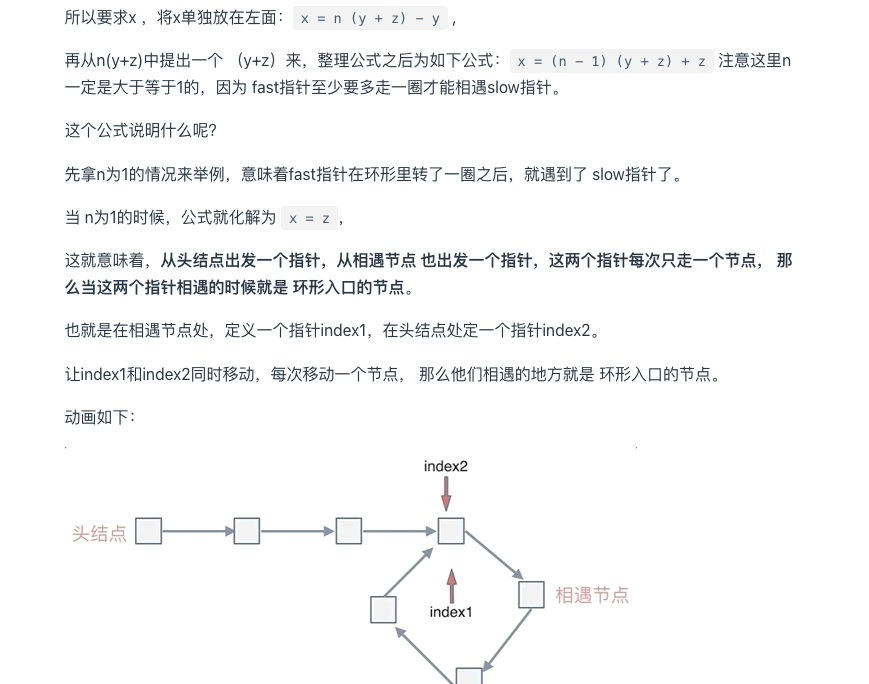

### 两两交换链表节点
核心： 使用虚拟头节点进行模拟，对于lianbiao的指针需要重新确定从而达到交换的效果
``` CPP

/**
 * Definition for singly-linked list.
 * struct ListNode {
 *     int val;
 *     ListNode *next;
 *     ListNode() : val(0), next(nullptr) {}
 *     ListNode(int x) : val(x), next(nullptr) {}
 *     ListNode(int x, ListNode *next) : val(x), next(next) {}
 * };
 */
class Solution {
public:
    ListNode* swapPairs(ListNode* head) {
        ListNode* dummynode = new ListNode(0);
        dummynode->next = head;
        ListNode * current = dummynode;
        while(current->next!=nullptr && current->next->next!=nullptr){
            ListNode* tmept1 = current->next;
            ListNode* tmept2 = current->next->next;

            current->next = tmept1->next;
            tmept1->next = tmept2->next;
            tmept2->next = tmept1;

            current = current->next->next;

        }
        return dummynode->next;
    


```

### 删除第N个节点
核心：使用快慢指针进行模拟，具体看代码，快指针先走n 后满指针开始行动
```CPP

class Solution {
public:
    ListNode* removeNthFromEnd(ListNode* head, int n) {
        ListNode* dummynode = new ListNode(0);
        dummynode->next = head;
        ListNode * n1 = dummynode;
        ListNode * n2 = dummynode;
        while(n-- && n1 != NULL) {
            n1 = n1->next;
        }
        n1 = n1->next;
        while(n1!=nullptr){
            n1 = n1->next;
            n2 = n2->next;
        }

        n2->next = n2->next->next;

        return dummynode->next;


    }
};
```


### 链表的交叉
核心：找到两个链表的共有部分，从尾部开始遍历，从而找到第一个两个链表上相同的元素
```cpp
/**
 * Definition for singly-linked list.
 * struct ListNode {
 *     int val;
 *     ListNode *next;
 *     ListNode(int x) : val(x), next(NULL) {}
 * };
 */
class Solution {
public:
    ListNode *getIntersectionNode(ListNode *headA, ListNode *headB) {
        int lenA =0;
        int lenB = 0;
        ListNode* curA = headA;
        ListNode* curB = headB;
        while (curA!=NULL){
            lenA++;
            curA = curA->next;
        }
        while (curB!=NULL){
            lenB++;
            curB = curB->next;
        }  
        curA = headA;
        curB = headB;
        if(lenA<lenB){
            swap(lenA,lenB);
            swap(curA,curB);
        }

        int gap = lenA - lenB;


        while(gap--){
            curA = curA->next;
        }

        while(curA!=NULL){
            if(curA==curB){
                return curA;
            }
            curA = curA->next;
            curB = curB->next;
        }
        return NULL;

    }
};

```

### 环形链表的交叉和入口位置
核心：推出入口位置和从入口出发的指针出发的关系



code:
```CPP
class Solution {
public:
    ListNode *detectCycle(ListNode *head) {
        ListNode* fast = head;
        ListNode* slow = head;
        while(fast != NULL && fast->next != NULL) {
            slow = slow->next;
            fast = fast->next->next;
            // 快慢指针相遇，此时从head 和 相遇点，同时查找直至相遇
            if (slow == fast) {
                ListNode* index1 = fast;
                ListNode* index2 = head;
                while (index1 != index2) {
                    index1 = index1->next;
                    index2 = index2->next;
                }
                return index2; // 返回环的入口
            }
        }
        return NULL;
    }
};

```