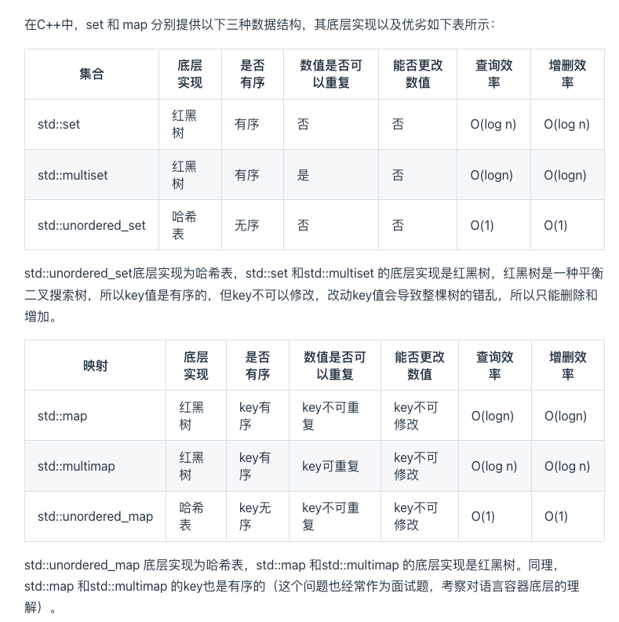

## hash table
工业开发：舍空间换时间
核心作用：用来判断一个元素是否在集合当中出现
通过取模操作让数值映射到hash table上

牢记：


#### 哈希碰撞

##### 拉链法

选择适当的hash table大小，不会因为数组为空值而浪费大量内存，也不会因为链表太长而浪费太多时间

##### 线性探测法

例如冲突的位置，放了小李，那么就向下找一个空位放置小王的信息。所以要求tableSize一定要大于dataSize ，要不然哈希表上就没有空置的位置来存放 冲突的数据了。（依次向下）

常用的三种数据结结构：

- 数组
- set（集合）
- map（映射）

[参考学习](https://programmercarl.com/%E5%93%88%E5%B8%8C%E8%A1%A8%E7%90%86%E8%AE%BA%E5%9F%BA%E7%A1%80.html#%E5%B8%B8%E8%A7%81%E7%9A%84%E4%B8%89%E7%A7%8D%E5%93%88%E5%B8%8C%E7%BB%93%E6%9E%84)

**总结**：总结一下，当我们遇到了要快速判断一个元素是否出现集合里的时候，就要考虑哈希法。
但是哈希法也是牺牲了空间换取了时间，因为我们要使用额外的数组，set或者是map来存放数据，才能实现快速的查找。
如果在做面试题目的时候遇到需要判断一个元素是否出现过的场景也应该第一时间想到哈希法！

而且如果哈希值比较少、特别分散、跨度非常大，使用数组就造成空间的极大浪费。

#### 题目

**两个数组的交集**：
核心：使用unorder_set
code:

```cpp

class Solution {
public:
    vector<int> intersection(vector<int>& nums1, vector<int>& nums2) {
        unordered_set<int> result_set; // 存放结果，之所以用set是为了给结果集去重
        int hash[1005] = {0}; // 默认数值为0
        for (int num : nums1) { // nums1中出现的字母在hash数组中做记录
            hash[num] = 1;
        }
        for (int num : nums2) { // nums2中出现话，result记录
            if (hash[num] == 1) {
                result_set.insert(num);
            }
        }
        return vector<int>(result_set.begin(), result_set.end());
    }
};
```

**两数之和**
核心：使用unordered_set来重新排布

我们不仅要知道元素有没有遍历过，还要知道这个元素对应的下标

**需要使用 key value结构来存放，key来存元素，value来存下标，那么使用map正合适** 。

无序所以使用unordered_map


```CPP

class Solution {
public:
    vector<int> twoSum(vector<int>& nums, int target) {
        std::unordered_map<int,int> map;
        for(int i=0;i<nums.size();i++){
            auto iter = map.find(target-nums[i]);
            if(iter!=map.end()){
                return {iter->second,i};
            }
            map.insert(pair<int,int>(nums[i],i));
        }

        return {};
        
    }
};

```
反复询问自己几个问题：
- 为什么会想到用哈希表：查找
- 哈希表为什么用map：返回索引
- 本题map是用来存什么的：数组的值和索引
- map中的key和value用来存什么的：key值 value 索引